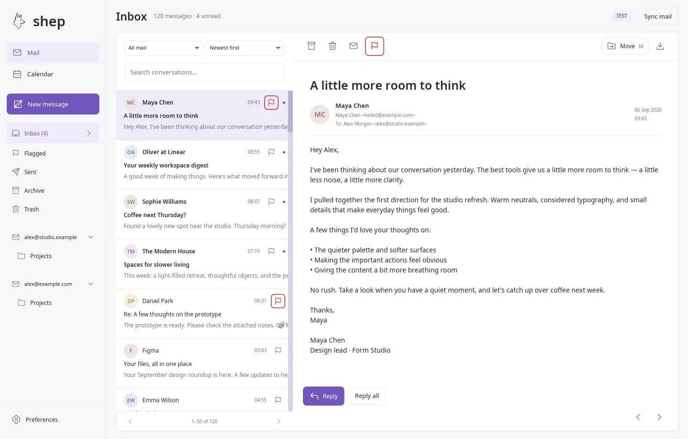
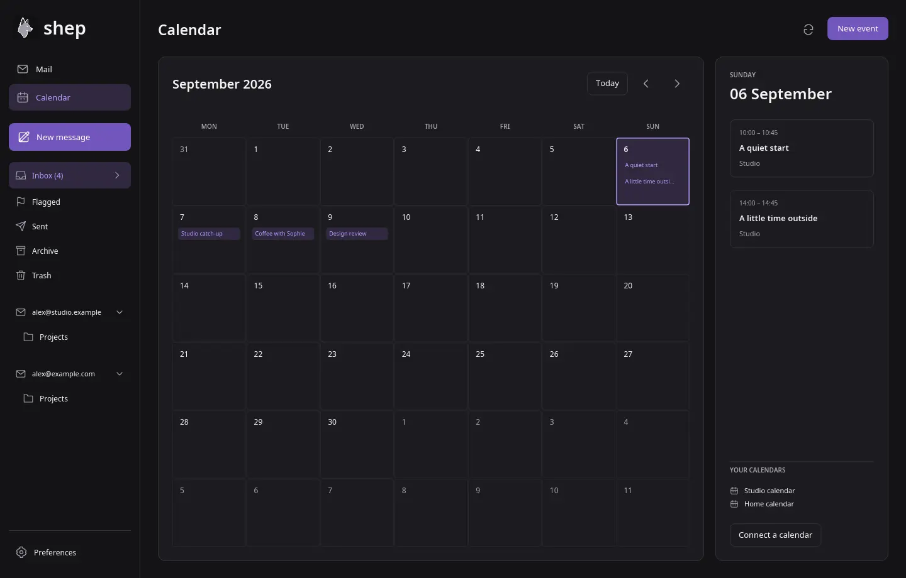

# Shep

A calm, native email and calendar app built with Rust and iced. Comfortable with a mouse, with remappable shortcuts when you want them.

[Documentation](https://sam-ruff.github.io/shep.so/) · [Install](docs/installation.md) · [Agent docs](docs/agents/index.md)

## Install

```sh
curl -fsSL https://raw.githubusercontent.com/sam-ruff/shep.so/main/scripts/install-release-linux.sh | bash
```

The Linux installer downloads a published release, verifies its checksum, and adds Shep to your applications menu. It defaults to your home directory; an interactive prompt also offers all-user installation or cancellation. Requires curl and Python 3.

**No binary releases are published yet while release CI is paused.** The installer reports this clearly; use [the source instructions](#get-started) until a release is available.

For macOS (built-in system tools, no Python):

```sh
curl -fsSL https://raw.githubusercontent.com/sam-ruff/shep.so/main/scripts/install-release-macos.sh | bash
```

This prepares `~/Applications/Shep.app` with its native icon; `--system` installs for all users. macOS release assets and actual desktop verification remain pending.

For Windows, run in PowerShell:

```powershell
& ([scriptblock]::Create((Invoke-RestMethod https://raw.githubusercontent.com/sam-ruff/shep.so/main/scripts/install-release-windows.ps1)))
```

Uses built-in PowerShell and Windows `tar.exe`. Installs under your user profile with a Start-menu shortcut; the prompt offers all-user installation. Windows release assets and actual desktop verification remain pending.



- **Mail in one place.** Multiple accounts, a unified inbox, search across folders, conversation reading and bulk actions with Undo.
- **Everyday essentials.** Replies, forwarding, printing, attachments, autosaved drafts and recovery for interrupted sends.
- **Calendars alongside.** Google Calendar and CalDAV, with a month view and agenda.
- **Make it yours.** Light, Dark or System appearance, editable color palettes, resizable panes, configurable shortcuts and new-mail popup/sound controls.
- **Encrypted backups.** Save to multiple local folders, Google Drive, S3-compatible storage, SFTP or FTP/FTPS. Google is optional.



*Native Linux screenshots with fictional demo mail and events.*

## Get started

With stable Rust (1.89 or newer) and the [Linux dependencies](docs/installation.md) installed, run from the checkout:

```sh
cargo run --release
```

Or install for your Linux user:

```sh
bash scripts/install-linux.sh
```

Add accounts and calendars in **Preferences**.

Mobile (`flutter/`), a separate browser client (`web/`), the promo site (`website/`) and a Rust beta gateway (`backend/`) are being developed in this monorepo. [Client parity and remaining work](docs/CLIENT_PARITY.md) records what is available; the new clients are previews, not replacements yet.

## Still in development

Fastmail login and Inbox sync have been verified. Live Google, other providers and Windows/macOS still need verification.

- Mail supports static HTML layout and selectable text, with a plain-text option. External images load only when your privacy settings allow them.
- Downloads: **25 MiB per message**; MIME nesting beyond 128 multipart levels is refused. Backups: **256 MiB of original mail**.
- Gmail needs an app password; Google sign-in does not provide Gmail OAuth.
- Calendar sync: **90 days back, 365 days ahead**. Edit recurring CalDAV series in your server's calendar UI.
- The local mail cache is not encrypted at rest.
- Complete database export/import is in Preferences. Imported profiles require credential reconnection; continuous account/profile sync is still in development.

[Full limits](docs/limits.md) · [Contributing](docs/development.md) · MIT licensed.
