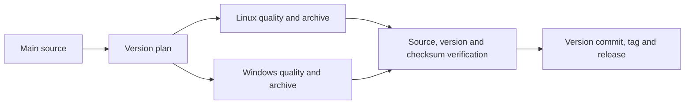

# Desktop release contract

Desktop releases publish Linux x86_64 and Windows x86_64 archives from one
successful main revision. Linux builds use Ubuntu 24.04; older glibc distributions
need a source build. Windows archives are unsigned. Apple packaging and the
coordinated mobile/browser release gate remain unfinished.

The plan cannot run publication plugins. Quality stamps the planned version,
runs platform checks and packages exact Cargo-reported executables. Linux also
runs native controls and performance gates inside the owned nonroot CI image.
The image pins Rust, Node and Chrome downloads, retains the browser sandbox and
does not mount profile storage or the Docker socket.

Publication only accepts a successful push from this repository while main still
matches its tested revision. It downloads that run's explicitly named artifacts,
checks both platform sidecars and each archive's provenance, and recomputes the
planned semantic version. A missing or rejected archive prevents publication.
The release tag identifies the subsequent version/changelog commit; each archive
records its tested source parent. No mail or Google user tokens enter artifacts.

The installers require the requested tag and exact asset URLs, then verify the
combined `SHA256SUMS`. An explicit version, missing asset or integrity failure
cannot silently select another release or a source build. Linux's latest-release
fallback remains available only while a published release is absent.

See [AGENTS.md](https://github.com/sam-ruff/shep.so/blob/main/AGENTS.md) for runner,
verification and shipping rules. The pipeline follows
[semantic-release's GitHub Actions integration](https://semantic-release.gitbook.io/semantic-release/recipes/ci-configurations/github-actions)
and keeps fork code outside the privileged workflow described in
[GitHub's security guidance](https://docs.github.com/en/actions/reference/security/secure-use).
